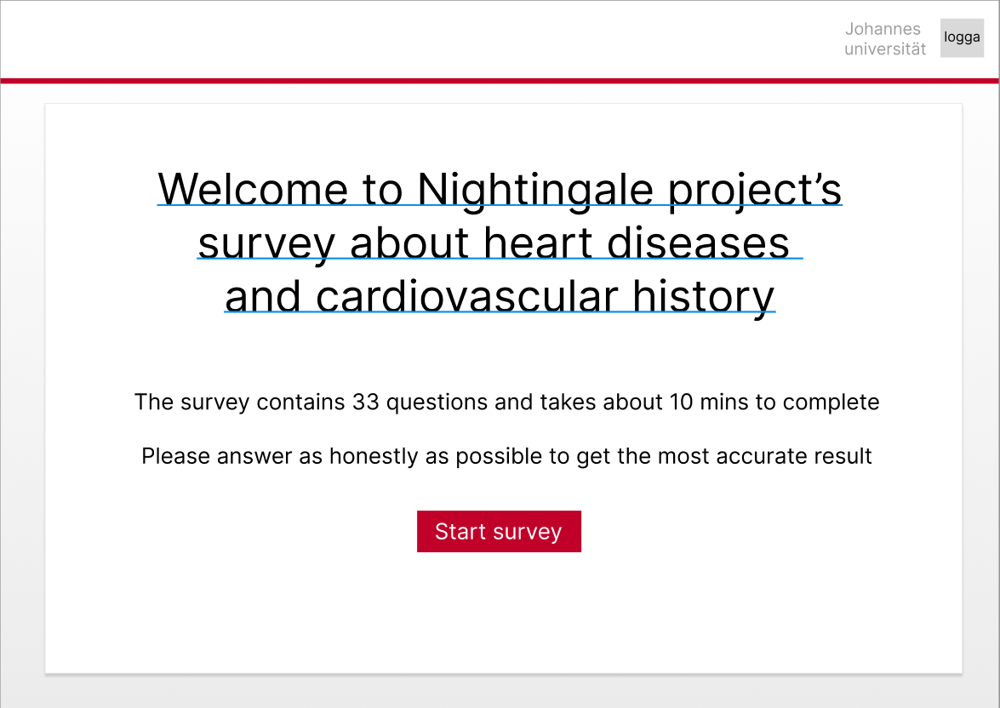
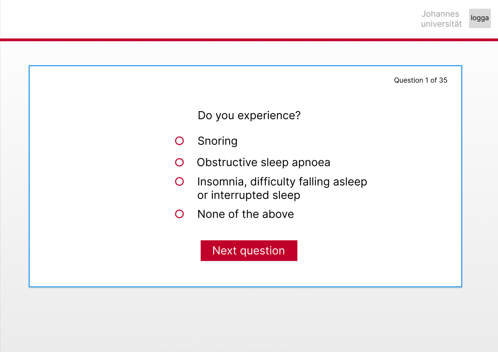
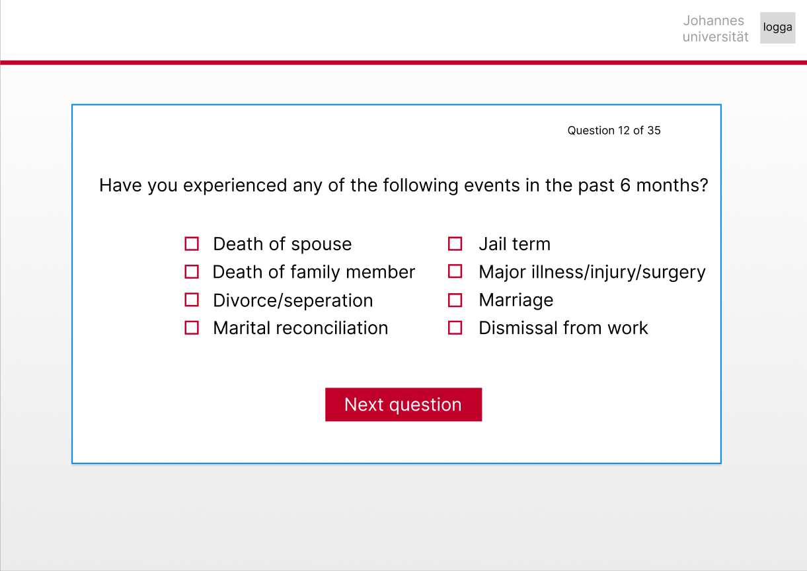
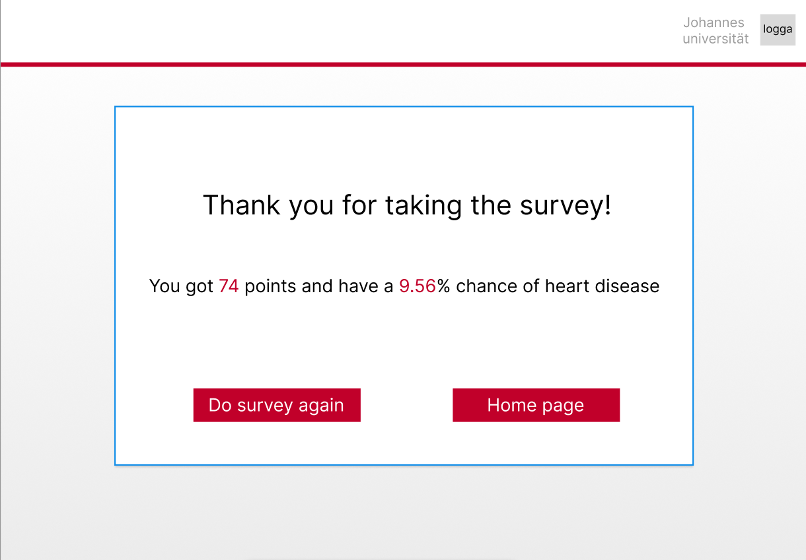
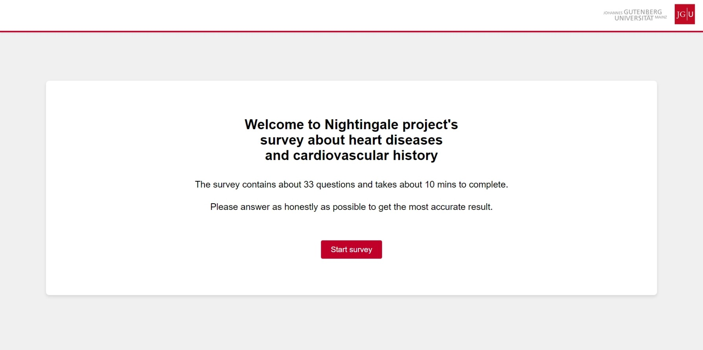
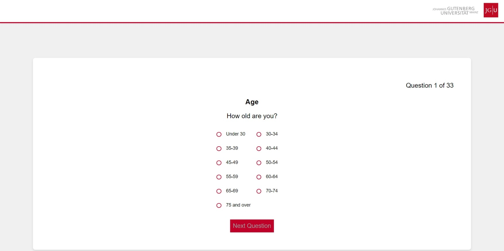
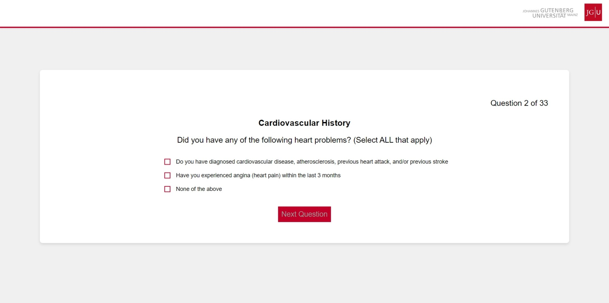
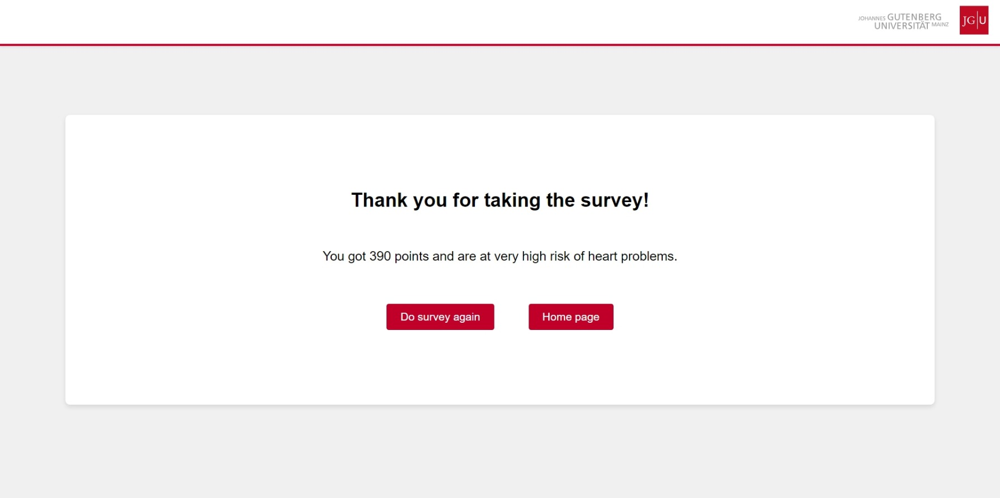

# Nightingale Heart and Cardiovascular survey

## The project description

As our first assignment during our internship at Johannes Guntenberg Universität Mainz we made a survey about a person's lifestyle and family history to calculate their chances of heart diseases.

We were provided with a pdf made by Metagenics that contained questions that we used for this survey to make sure the questions and answers are relevant for the context. There was no design or idea on what the actual website was going to look like, so we decided to take a look at their current website (https://nightingale.uni-mainz.de/) and use that as inspiration to make sure it matched, and then used Figma to create wireframes so we had something to go after.

## Authors

- [@Pingis2](https://github.com/Pingis2)
- [@oscarkannerstedt](https://github.com/oscarkannerstedt)

## Project built with


## Initial Wireframes

| **Title**              | **Wireframe**  |
|------------------------|----------------|
| Start page Wireframe     |  |
| Single choice option Wireframe     |  |
| Multiple choice option Wireframe    |  |
| Result page Wireframe   |  |


## Final result

| **Title**              | **Final result**  |
|------------------------|----------------|
| Start page final version    |  |
| Single choice option final version    |  |
| Multiple choice option final version    |  |
| Result page final version   |  |

## Start project

```
npm i
npm run dev
```

## Dependencies

```
axios
react
react-dom
react-router-dom
sass
```

## Lessons learned

During our schooling we were always provided with clear instructions and info on what we were going to create, so we were kind of spoiled of always having everything on paper, but when working with real companies you can't really expect that and it's something that we weren't really prepared for, but with a lot of asking and discussing we were able to create something that checked their visions and requirements.

## Detected errors so far
- In the QuestionDisplay file, there are errors about "type" issues and we don't currently know how to fix it, but it's not stopping the code itself from working as intended in any way.